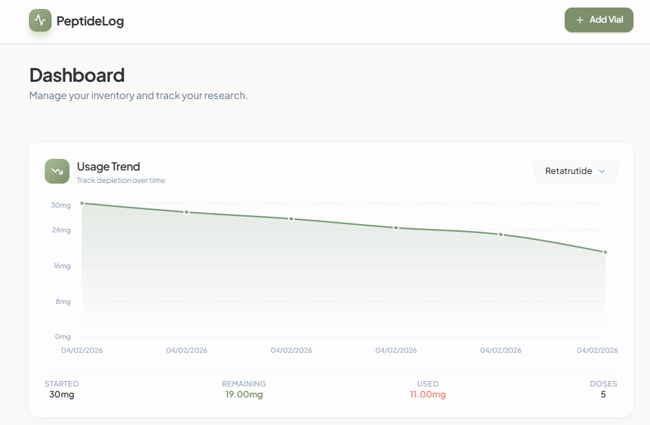
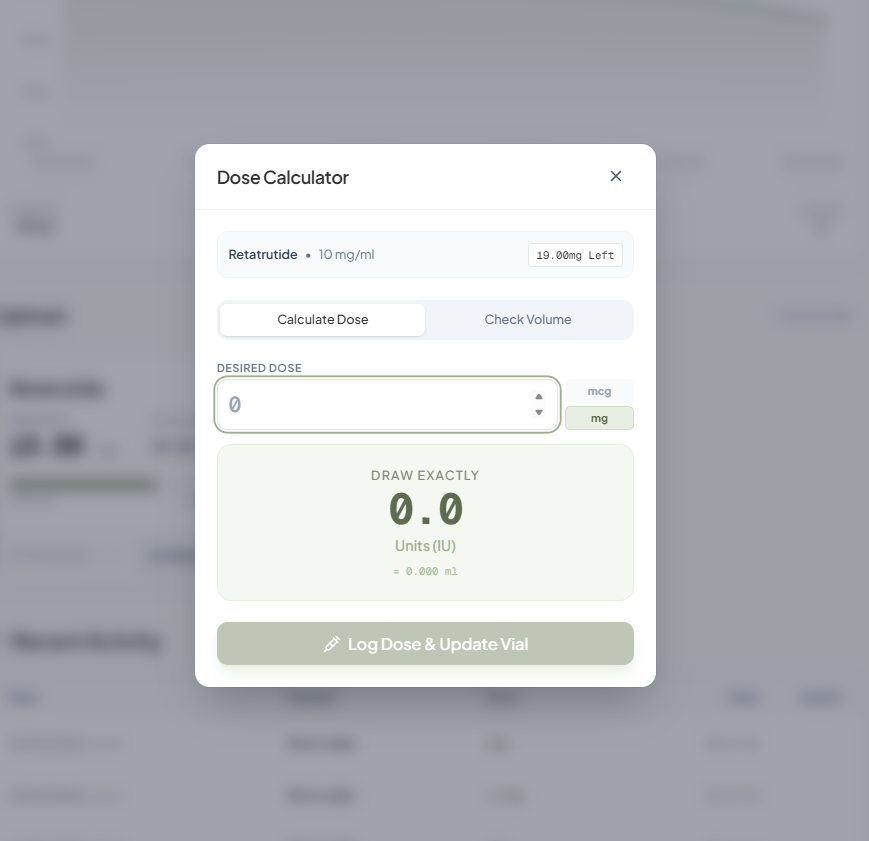

#  PeptideLog

A beautiful, modern peptide tracking dashboard for researchers. Track your vial inventory, calculate doses, and monitor usage trends — all stored locally in your browser.


> **Note:** This app was built for personal use and is intended for use on localhost as of now. All data is stored in your browser's localStorage — no server, no cloud, no accounts. Just clone, install, and run locally on your machine. I didnt want to deal with the hassle of setting up a database and authentication, so I opted for a simpler approach. this was a quick project I needed to make for myself. feel free to use it as well, i tried to make it easy to use and understand.

---

## Features

- ** Vial Management** — Add, track, and remove peptide vials with automatic concentration calculations
- ** Smart Dose Calculator** — Calculate exact units/ml needed for your desired dose (mg or mcg)
- ** Usage Trends** — Interactive charts showing vial depletion over time
- ** Local Storage** — All data stays in your browser, no account required
- ** Beautiful UI** — Glassmorphism design with smooth animations
- ** Responsive** — Works on desktop and mobile
- ** Peptide Autocomplete** — 100+ popular peptides with smart suggestions

---

## Screenshots

| Dashboard | Dose Calculator |
|-----------|-----------------|
|  |  |
| Track all your vials at a glance with remaining amounts and usage stats | Smart calculator with validation to prevent overdrawing |

---

##  Quick Start

### Prerequisites
- [Node.js](https://nodejs.org/) 18+ installed

### Installation

```bash
# Clone the repository
git clone https://github.com/YOUR_USERNAME/peptide-log.git
cd peptide-log

# Install dependencies
npm install

# Start development server
npm run dev
```

Open [http://localhost:3000](http://localhost:3000) in your browser.

### Production Build

```bash
# Build static export
npm run build

# Serve locally
npm run serve
```

This opens the app at [http://localhost:3333](http://localhost:3333).

---

## Tech Stack

- **Framework**: [Next.js 16](https://nextjs.org/) with App Router
- **Language**: [TypeScript](https://www.typescriptlang.org/)
- **Styling**: [Tailwind CSS 4](https://tailwindcss.com/)
- **State**: [Zustand](https://zustand-demo.pmnd.rs/) with localStorage persistence
- **Charts**: [Recharts](https://recharts.org/)
- **Animations**: [Framer Motion](https://www.framer.com/motion/)
- **Icons**: [Lucide React](https://lucide.dev/)

---

##  Project Structure

```
src/
├── app/                 # Next.js App Router
│   ├── layout.tsx       # Root layout with fonts
│   ├── page.tsx         # Main dashboard page
│   └── globals.css      # Global styles & Tailwind
├── components/
│   ├── cabinet/         # Vial cards & modals
│   ├── calculator/      # Dose calculator
│   ├── charts/          # Usage trend chart
│   └── ui/              # Reusable UI components
├── data/
│   └── peptides.ts      # Popular peptide names for autocomplete
├── lib/
│   ├── math.ts          # Dose calculation utilities
│   └── utils.ts         # Helper functions
└── store/
    └── useStore.ts      # Zustand state management
```

---

##  How It Works

1. **Add a Vial** — Enter peptide name, total amount (mg), and reconstitution water (ml)
2. **Auto-Calculate** — Concentration is calculated automatically
3. **Draw Doses** — Use the calculator to determine exact units for your desired dose
4. **Track Usage** — View remaining amounts and usage history over time

### Dose Calculation Formula

```
Units = (Dose in mg / Concentration) × 100
```

Where:
- **Dose** = Amount you want to inject (mg)
- **Concentration** = mg per ml (calculated from total mg ÷ water ml)
- **100** = Converts ml to insulin units (100 IU = 1ml)

---

##  Disclaimer

This tool is for **research and tracking purposes only**. Always consult qualified professionals for medical decisions. The developers are not responsible for any misuse of this software.

---

## 📄 License

MIT License — feel free to use, modify, and distribute.

---

##  Contributing

Contributions welcome! Feel free to open issues or submit pull requests.

---

<p align="center">
  Made with ❤️ for the research community
</p>
